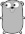

# asciify

[](https://pkg.go.dev/github.com/tjhorner/asciify)

Asciify is an ASCII art library written in Go. It has no external dependencies and is fairly customizable.

You can use it to convert images to ASCII art (and back to an image again, if you really want to).

## Usage

```shell
go get github.com/tjhorner/asciify
```

## Examples

### Asciify With Default Palette

Pass in an `image.Image` to `Asciify` and it will do the thing.

```go
// Pretend we have `img` defined somewhere
result := asciify.Asciify(img, asciify.DefaultCharacterPalette)

// `result` is of type `ASCIIArt`, which you can use like a `[][]string`
char := result[0][5]

// Or if you want the art as a single string, use the String() convenience method
fmt.Println(result.String())
```

<details>
  <summary>Result</summary>

  ### Input
  

  ### Output
  ```
        `-vUx/(|fvC1"      
    :l^-J/{]????[}{|Y[)r~. 
  .)njCf[~<]}??}+;:>}/j1f- 
  >juc1?`  .+[[+^   >[f0[C.
  {)wv[]zi  ,}}|q>  "}]x[J 
  Izf}[x#[  ^}[rd<  ,}?(Y< 
  !Y?[??^  i)/[l. '_[-1}  
  ^c??}>,:<|b%O]<~]}??[f  
  :r???[}}{1Y0f1}[]???]X  
  lt??????}-~-<]}??????L. 
  lt??????])<+]1???????U. 
  ;j???????}_?]]???????Y' 
  ,x???????]{{}????????X' 
  ^v???????????????????z` 
  'Y???????????????????z` 
  .C???????????????????z` 
  ^+U???????????????????x):
  U?(???????????????????)?c
  Xjv???????????????????tvC
  ::J???????????????????fi`
  `z???????????????????/! 
  "u???????????????????|> 
  ,x???????????????????|> 
  ;j???????????????????|i 
  ;j???????????????????fI 
  ,x???????????????????u" 
  `z???????????????????C. 
    U??????????????????[f  
    }{?????????????????j!  
    ^U????????????????[u   
    ~x?????????????-[Y:   
    .)/)}??????????]()}|   
    !tifcCj1}]][}(nY]J+z^  
    ;Yx~ '.

```go
// Let's use a custom palette
palette := asciify.CharacterPalette{"A", "B", "C", "1", "2", "3"}

result := asciify.Asciify(img, palette)

fmt.Println(result.String())
```

<details>
  <summary>Result</summary>

  ### Input
  

  ### Output
  ```
  33333332CC11111CC13333333
  333232C11222221111C111233
  3111C11222122122321111123
  21CC12333321123333211C1C3
  11BC12C2333111B23331211C3
  2C1111B1333111B2333121C23
  32C2122333211123332121133
  33C22123321BAC22211221133
  32122211111CC111122222C33
  3212222221222221222222C33
  3212222222122212222222C33
  3212222222122222222222C33
  3312222222211122222222C33
  33C2222222222222222222C33
  33C2222222222222222222C33
  33C2222222222222222222C33
  32C2222222222222222222113
  C21222222222222222222212C
  C1C22222222222222222221CC
  22C2222222222222222222123
  33C2222222222222222222123
  33C2222222222222222222123
  3312222222222222222222123
  3212222222222222222222123
  3212222222222222222222123
  3312222222222222222222C33
  33C2222222222222222222C33
  33C2222222222222222221133
  3311222222222222222221233
  333C22222222222222221C333
  33321222222222222221C2333
  3331111222222222221111333
  332121CC11112111CC2C2C333
  332C1233211CC1122332C1333
  ```
</details>

### Imagify

If you have some ASCII art and know the palette that was used to create it, you can also turn it back into an image.

This is pretty much just for fun and shouldn't ever be used in any serious way, as the resulting image will be extremely lossy (depending on your palette) and in grayscale.

```go
// Turn an image into ASCII art
result := asciify.Asciify(img, asciify.DefaultCharacterPalette)

// Then re-imagify it
imagified, _ := asciify.Imagify(result, asciify.DefaultCharacterPalette)
```

<details>
  <summary>Result</summary>

  ### Input
  ```
        'I]fzJYv|<`       
      '-cQZmmmmO0QY['^:.  
  ^tn?uOdbZ0mm0p#Mk0XvLn' 
  .rxjLm%$$@pOOp8$$$kOz}O< 
  `J-rOZfh$$W00U_k$$&0ZuO> 
  {z0Ou;O$$80Ov~b$$W0mJ}. 
    }mOmm8$$hCYOo@$BqOwC'  
    )mm0kWMbU<`[ZbdZ0mmO,  
    rmmmO00QL/}zL0OZmmmZ!  
    ummmmmm0wdwbZ0mmmmmm+  
    ummmmmmZCbpZLmmmmmmm?  
    xmmmmmmm0qmZZmmmmmmm[  
    tmmmmmmmZQQ0mmmmmmmm}  
    )mmmmmmmmmmmmmmmmmmm}  
    ]mmmmmmmmmmmmmmmmmmm{  
    _mmmmmmmmmmmmmmmmmmm1  
  .]mmmmmmmmmmmmmmmmmmmf^ 
  ?OJmmmmmmmmmmmmmmmmmmmCm1
  {f/mmmmmmmmmmmmmmmmmmmc)-
    -mmmmmmmmmmmmmmmmmmmn. 
    }mmmmmmmmmmmmmmmmmmmc. 
    |mmmmmmmmmmmmmmmmmmmz. 
    fmmmmmmmmmmmmmmmmmmmX. 
    rmmmmmmmmmmmmmmmmmmmz. 
    rmmmmmmmmmmmmmmmmmmmn  
    tmmmmmmmmmmmmmmmmmmm|  
    {mmmmmmmmmmmmmmmmmmm_  
    immmmmmmmmmmmmmmmmmO,  
    `Cmmmmmmmmmmmmmmmmmx.  
    ]mmmmmmmmmmmmmmmmOI   
    .jmmmmmmmmmmmmmwO{    
    ^cC0mmmmmmmmmmZYJC"   
    .uhr;_xJ0ZZOQX/i'_p1   
    }/.   `,;I:^'    ~,   
  ```

  ### Output
  
</details>

## FAQ

### Can I resize the output image?

No, as that is outside the scope of this project. Since asciify takes in an `image.Image`, it's compatible with the rest of the Go ecosystem, so you could use a library like this to do the resizing before you asciify the image: https://github.com/nfnt/resize

### Shouldn't you be using runes instead of strings?

Probably. My excuse is that someone somewhere might want to use multiple characters to represent a pixel.

## License

```
Copyright 2020 TJ Horner

Permission is hereby granted, free of charge, to any person obtaining a copy of this software and associated documentation files (the "Software"), to deal in the Software without restriction, including without limitation the rights to use, copy, modify, merge, publish, distribute, sublicense, and/or sell copies of the Software, and to permit persons to whom the Software is furnished to do so, subject to the following conditions:

The above copyright notice and this permission notice shall be included in all copies or substantial portions of the Software.

THE SOFTWARE IS PROVIDED "AS IS", WITHOUT WARRANTY OF ANY KIND, EXPRESS OR IMPLIED, INCLUDING BUT NOT LIMITED TO THE WARRANTIES OF MERCHANTABILITY, FITNESS FOR A PARTICULAR PURPOSE AND NONINFRINGEMENT. IN NO EVENT SHALL THE AUTHORS OR COPYRIGHT HOLDERS BE LIABLE FOR ANY CLAIM, DAMAGES OR OTHER LIABILITY, WHETHER IN AN ACTION OF CONTRACT, TORT OR OTHERWISE, ARISING FROM, OUT OF OR IN CONNECTION WITH THE SOFTWARE OR THE USE OR OTHER DEALINGS IN THE SOFTWARE.
```